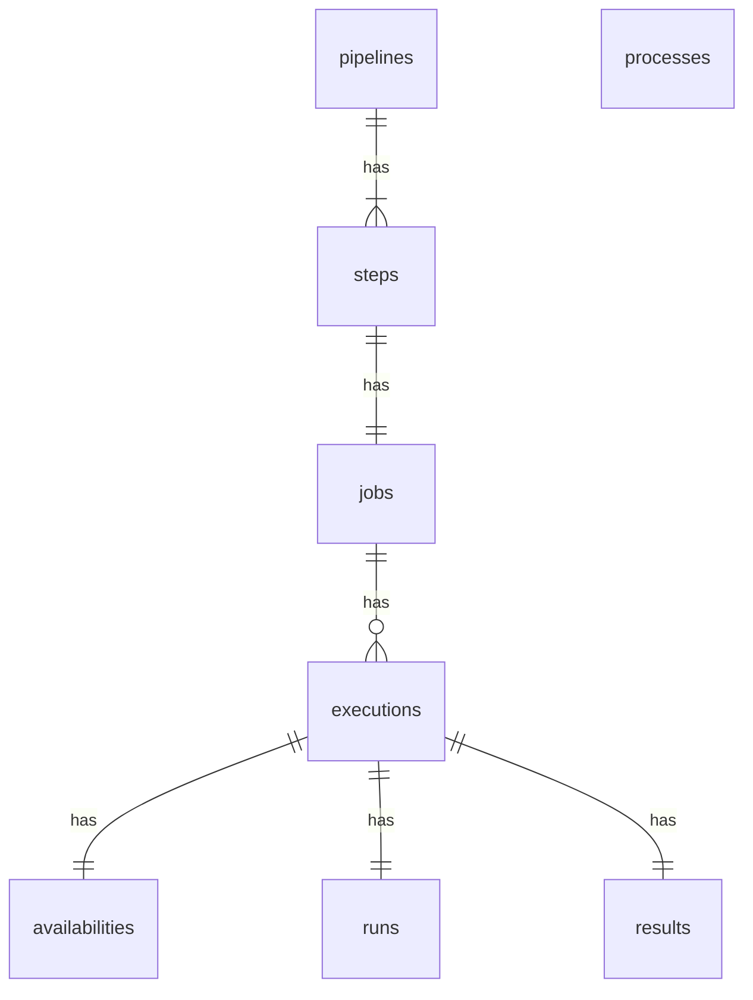

# Data Model

```mermaid
erDiagram
    pipelines ||--|{ steps : has
    steps ||--|| jobs : has
    jobs ||--o{ executions : has
    executions ||--|| availabilities : has
    executions ||--|| runs : has
    executions ||--|| results : has
    processes
```
