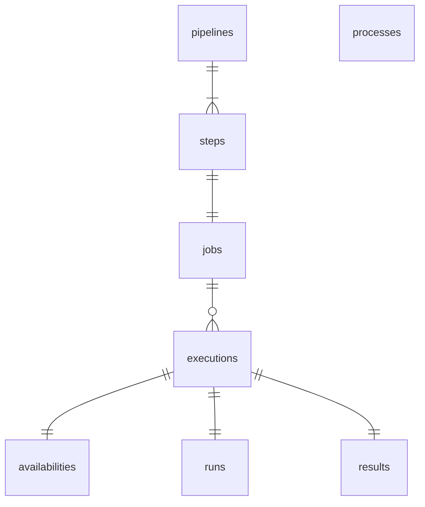

# Data Model

```mermaid
erDiagram
    pipelines ||--|{ steps : ""
    steps ||--|| jobs : ""
    jobs ||--o{ executions : ""
    executions ||--|| availabilities : ""
    executions ||--|| runs : ""
    executions ||--|| results : ""
    processes
```
