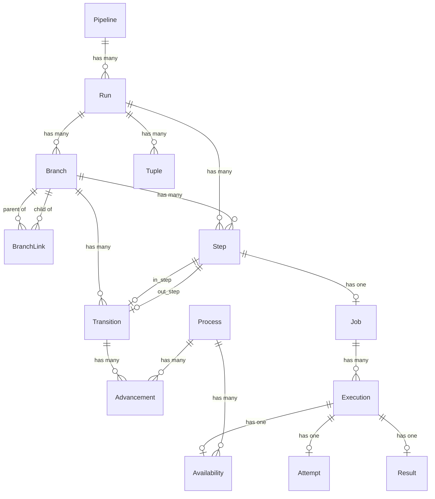

# Data Model

```mermaid
  erDiagram
      Pipeline {
      }

      Run {
      }

      Branch {
      }

      BranchLink {
      }

      Step {
      }

      Transition {
      }

      Advancement {
      }

      Job {
      }

      Execution {
      }

      Attempt {
      }

      Availability {
      }

      Result {
      }

      Process {
      }

      Tuple {
      }

      Pipeline ||--o{ Run : "has many"
      Run ||--o{ Branch : "has many"
      Run ||--o{ Step : "has many"
      Run ||--o{ Tuple : "has many"
      Branch ||--o{ Step : "has many"
      Branch ||--o{ Transition : "has many"
      Branch ||--o{ BranchLink : "parent of"
      Branch ||--o{ BranchLink : "child of"
      Step ||--o| Job : "has one"
      Step ||--o| Transition : "in_step"
      Step ||--o| Transition : "out_step"
      Transition ||--o{ Advancement : "has many"
      Job ||--o{ Execution : "has many"
      Execution ||--o| Availability : "has one"
      Execution ||--o| Attempt : "has one"
      Execution ||--o| Result : "has one"
      Process ||--o{ Advancement : "has many"
      Process ||--o{ Availability : "has many"
```
